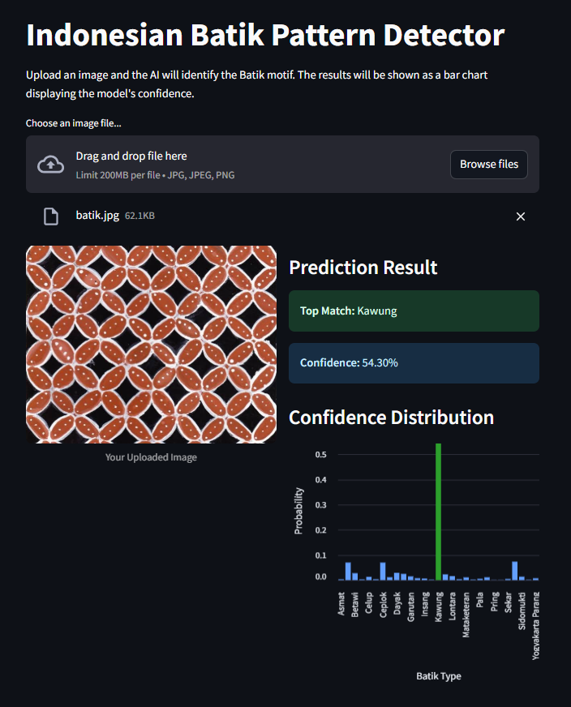
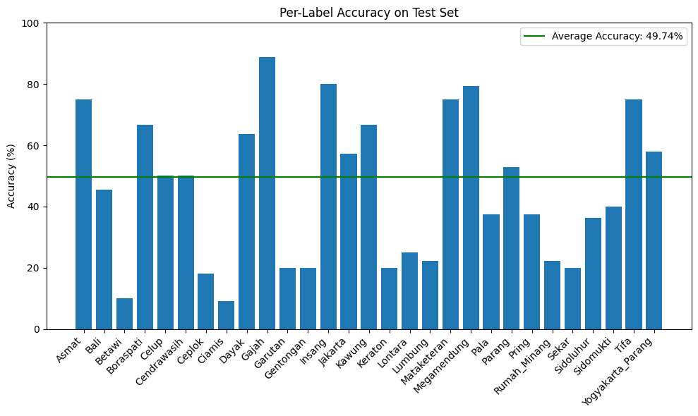

# Batik Classifier

Klasifikasi motif batik menggunakan PyTorch dengan arsitektur efficientnet_b0

## Dataset
- https://huggingface.co/datasets/muhammadsalmanalfaridzi/Batik-Indonesia
- https://www.kaggle.com/datasets/dionisiusdh/indonesian-batik-motifs

## Contoh app

## Akurasi model

